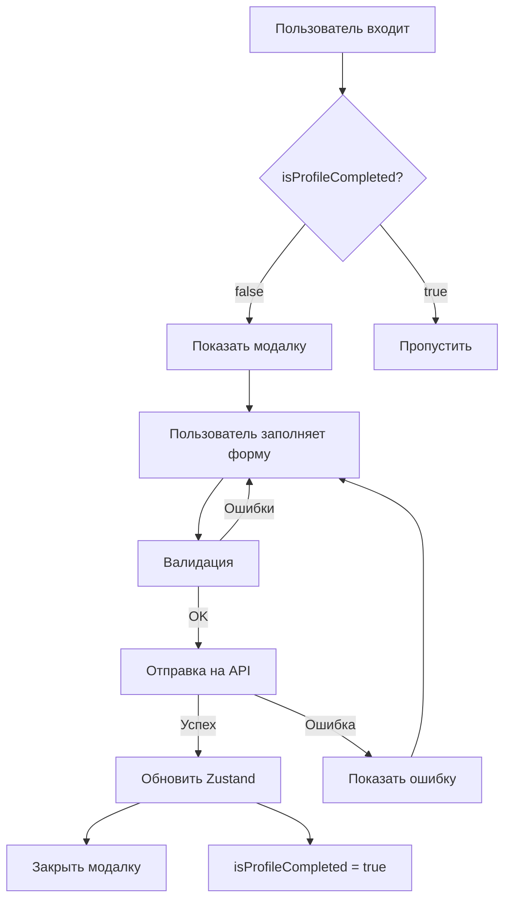

# CompleteProfileModal

Модальное окно для обязательного заполнения профиля после регистрации/логина.

## 🎯 Назначение

Автоматически показывается пользователям с `isProfileCompleted === false` и требует заполнения профиля перед использованием приложения.

## 📦 Структура файлов

```
src/
├── components/
│   └── modals/
│       └── CompleteProfileModal.tsx   # Компонент модалки
├── hooks/
│   └── useCompleteProfile.ts          # React Query мутация
├── services/
│   └── userService.ts                 # API сервис
├── store/
│   └── authStore.ts                   # Zustand store (обновлен)
└── providers/
    └── AuthProvider.tsx               # Провайдер (обновлен)
```

## 🚀 Использование

### Автоматическое открытие (уже настроено):

```typescript
// Модалка автоматически открывается в следующих случаях:

// 1. После регистрации
// 2. После логина (если профиль не заполнен)
// 3. При загрузке приложения (если профиль не заполнен)
```

### Программное открытие:

```typescript
import { useAuthStore } from '@/store/authStore';

function MyComponent() {
  const openProfileModal = useAuthStore(s => s.openProfileModal);
  
  return <button onClick={openProfileModal}>Заполнить профиль</button>;
}
```

## 📝 Поля формы

| Поле | Тип | Обязательное | Валидация |
|------|-----|--------------|-----------|
| specialization | string | ✅ | Минимум 3 символа |
| about | string | ✅ | Минимум 10 символов |
| skills | string[] | ✅ | Минимум 1 элемент |
| interests | string[] | ✅ | Минимум 1 элемент |
| status | UserStatus | ❌ | Один из предустановленных |

## 🎨 Особенности UI

- **Tag Input**: Нажмите Enter для добавления навыка/интереса
- **Валидация**: Реалтайм проверка с подсветкой ошибок
- **Кнопка**: Активна только при валидной форме
- **Loader**: Показывается во время отправки
- **Анимации**: Плавное появление и исчезновение
- **Блокировка**: Нельзя закрыть до заполнения всех полей

## 🔧 API

### Endpoint

```
PATCH /users/profile
```

### Request

```json
{
  "specialization": "Frontend Developer",
  "about": "Experienced React developer...",
  "skills": ["React", "TypeScript"],
  "interests": ["Web Development", "UI/UX"],
  "status": "Открыт к предложениям"
}
```

### Response

```json
{
  "user": {
    "_id": "...",
    "isProfileCompleted": true,
    ...
  }
}
```

## 🎯 Логика работы



## 📱 Пример использования хука

```typescript
import { useCompleteProfile } from '@/hooks/useCompleteProfile';

function MyForm() {
  const { mutate, isPending, isError, error } = useCompleteProfile();

  const handleSubmit = (data) => {
    mutate(data);
  };

  return (
    <form onSubmit={handleSubmit}>
      {/* Ваши поля */}
      <button disabled={isPending}>
        {isPending ? 'Сохранение...' : 'Сохранить'}
      </button>
    </form>
  );
}
```

## 🔄 Обновление профиля

Если нужно обновить профиль позже:

```typescript
import { userService } from '@/services/userService';
import { useAuthStore } from '@/store/authStore';

async function updateProfile() {
  const { user } = await userService.updateProfile({
    status: 'Работаю над проектом'
  });
  
  useAuthStore.getState().setUser(user);
}
```

## 🐛 Отладка

### Проверить статус модалки:

```typescript
const showProfileModal = useAuthStore(s => s.showProfileModal);
console.log('Modal visible:', showProfileModal);
```

### Проверить профиль пользователя:

```typescript
const user = useAuthStore(s => s.user);
console.log('Profile completed:', user?.isProfileCompleted);
```

### Принудительно открыть модалку:

```typescript
useAuthStore.getState().openProfileModal();
```

### Принудительно закрыть модалку:

```typescript
useAuthStore.getState().closeProfileModal();
```

## ⚙️ Кастомизация

### Изменить статусы:

```typescript
// CompleteProfileModal.tsx
const STATUS_OPTIONS: UserStatus[] = [
  'Открыт к предложениям',
  'Ищу команду',
  'Ваш новый статус', // Добавьте здесь
];
```

### Изменить валидацию:

```typescript
// CompleteProfileModal.tsx
const validateForm = () => {
  // Ваши правила валидации
  if (specialization.length < 5) { // Изменить с 3 на 5
    // ...
  }
};
```

### Добавить новые поля:

```typescript
// 1. Добавить в userService.ts
export interface CompleteProfileData {
  // ...существующие поля
  newField: string; // Новое поле
}

// 2. Добавить state в CompleteProfileModal.tsx
const [newField, setNewField] = useState('');

// 3. Добавить JSX
<input
  value={newField}
  onChange={(e) => setNewField(e.target.value)}
/>

// 4. Добавить в handleSubmit
completeProfile({
  // ...
  newField,
});
```

## ✅ Проверка работоспособности

1. Создайте нового пользователя
2. ✅ Модалка должна открыться автоматически
3. Попробуйте кликнуть вне модалки
4. ✅ Модалка НЕ должна закрыться
5. Заполните все поля
6. ✅ Кнопка должна стать активной
7. Нажмите "Сохранить профиль"
8. ✅ Модалка должна закрыться
9. Перезагрузите страницу
10. ✅ Модалка НЕ должна появиться снова

## 📚 Связанные файлы

- `src/types/user.ts` - Типы пользователя
- `src/api/endpoints.ts` - API endpoints
- `src/api/axios.ts` - Axios instance
- `src/hooks/useVkLogin.tsx` - Логин хук
- `src/hooks/useVkRegister.tsx` - Регистрация хук

## 🚨 Важно

- Модалка использует `position: fixed` - убедитесь, что нет конфликтов z-index
- Модалка требует React Query Provider - уже настроен в `QueryProvider`
- Модалка требует Zustand store - уже настроен в `authStore`
- API endpoint должен возвращать обновленного пользователя с `isProfileCompleted: true`

---

**Версия**: 1.0.0  
**Дата создания**: 06.12.2025  
**Статус**: ✅ Готово к продакшену


